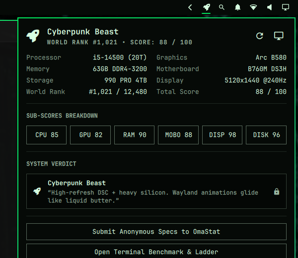

# 🏆 OmaRank (`ozdil.omarank`)

[](https://omarchy.org)
[](https://www.rust-lang.org/)
[](https://opensource.org/licenses/MIT)
[](#security--privacy)

**OmaRank** is a hardware benchmarking and tier-ranking plugin for the [Omarchy](https://omarchy.org) desktop environment. Built with a high-performance **Rust engine**, it benchmarks your silicon, assigns a humorous title from the **OmaRank Tier Ladder**, renders a sleek Quickshell bar widget with an interactive popover, and provides an opt-in anonymous hardware survey hub (**OmaStat**).

<p align="center">
  
</p>

---

## 🌟 Highlights

- ⚡ **Native Rust Engine (`omarank-engine`)**: Fast, zero-overhead hardware detection directly from Linux sysfs (`/proc/cpuinfo`, `/proc/meminfo`, `/sys/class/drm/`, `/sys/class/dmi/id/`, `lspci`, `inxi`, `hyprctl`).
- 🎯 **0–100 Weighted OmaScore (6-Component Breakdown)**:
  - **CPU (24%)**: Physical cores, hyperthreads, clockspeed.
  - **GPU (32%)**: Dedicated GPU tier, driver classification (`xe`, `amdgpu`, `nvidia`).
  - **RAM (16%)**: Generation (DDR3/DDR4/DDR5), speed in MT/s, multi-channel slots, capacity.
  - **Motherboard (8%)**: Chipset tiers (Z890, Z790, B760, X870E, B650, etc.) and enthusiast series recognition.
  - **Display (15%)**: High-refresh gaming/ultrawide panel detection (e.g. 5120x1440 @ 240Hz DSC).
  - **Storage (5%)**: NVMe model recognition (e.g. Samsung 990 PRO) and PCIe Gen4/5 vs SATA/HDD.
- 🌐 **OmaStat Global Leaderboard & Tier Matrix**:
  - Deterministic World Rank position (e.g. `#1,021` of 12,480 battlestations globally).
  - Complete S+ to F Tier matrix highlighting your battlestation (`omarank-engine --ladder`).
- 🎨 **Native Quickshell Bar Widget (`Panel.qml`)**:
  - Monochrome Nerd Font rank icon in the top bar matching native Omarchy bar widgets (``).
  - 4-column telemetry grid for Processor, Graphics, Memory, Motherboard, Storage, Display, World Rank, and Total Score.
  - 6-pill segmented sub-score breakdown row.
  - Clean, icon-free action buttons and system verdict card.
- 📡 **OmaStat Community Survey**:
  - Optional, privacy-preserving hardware survey similar to the Steam Hardware Survey.
  - 100% anonymous: strictly zero personal data, zero MAC addresses, zero IP logging, zero usernames, zero hardware serial numbers.

---

## 🪜 The OmaRank Tier Ladder

| OmaScore | Icon | Rank Tier | Critic Quote |
| :---: | :---: | :--- | :--- |
| **96–100** | 🌌 | **Cosmic Reality Simulator** | *Is this a quantum supercomputer? The pinnacle of silicon evolution.* |
| **89–95** | 🛸 | **NASA Supercomputer** | *Hyprland bowed in respect before the kernel even finished booting.* |
| **76–88** | 🚀 | **Cyberpunk Beast** | *High-refresh DSC + heavy silicon. Wayland animations glide like liquid butter.* |
| **61–75** | 🏎️ | **Gaming Chair Missing** | *High refresh rate, solid GPU. Now you can only blame your own reflexes.* |
| **46–60** | 🚗 | **Honest Daily Driver** | *Reliable workhorse. Won't break records, won't break a sweat. Perfectly balanced.* |
| **31–45** | 🚲 | **Budget Warrior** | *Proud veteran silicon. Smooth in 720p, doubles as a space heater on 1080p60.* |
| **16–30** | 📻 | **Study Mode Only** | *Fans are quiet as long as you only open LibreOffice and htop. Don't push your luck.* |
| **0–15** | 🥔 | **Potato Toaster** | *You installed Arch on a microwave. The cooling fans are screaming for mercy.* |

---

## 🔒 Security & Marketplace Hardening

Adheres strictly to the **Omarchy Marketplace Security Baseline**:

1. **No QML Markup Injection**: Every `Text` element in `Panel.qml` explicitly sets `textFormat: Text.PlainText`.
2. **Safe IPC & Process Execution**: All CLI calls use explicit argument arrays (`command: ["omarank-engine", "--json"]`), completely eliminating shell injection vectors.
3. **Bounded Buffers**: `StdioCollector` output is strictly bounded to 64 KiB (`65536` bytes).
4. **Process Lifecycle Safety**: Uses bounded timeout timers (`launchDeadlineTimer: 5000ms`) and terminates all child processes upon `Component.onDestruction`.
5. **No `/tmp` Path Traversal**: Local opt-in state is saved to `$XDG_STATE_HOME/omarank/survey_state.json` with secure `0600` file permissions.

---

## 📦 Installation

### Option 1: Via Pacman (Arch Linux / Omarchy Package)

Build and install using `makepkg` and `pacman`:

```bash
git clone https://github.com/ozdil/omarchy-omarank.git
cd omarchy-omarank
makepkg -si
```

Or install the prebuilt `.pkg.tar.zst`:

```bash
sudo pacman -U omarchy-omarank-1.0.1-1-x86_64.pkg.tar.zst
```

### Option 2: Via Omarchy CLI

```bash
omarchy plugin add https://github.com/ozdil/omarchy-omarank --enable
```

---

## 💻 CLI Usage

The standalone engine can be run directly from any terminal:

```bash
# Display rich ANSI hardware score card
omarank-engine

# View full tier ladder
omarank-engine --ladder

# Output machine-readable JSON (for scripts/polybar/waybar)
omarank-engine --json

# Submit anonymous hardware profile to OmaStat survey
omarank-engine --submit-survey
```

---

## 📄 License

Distributed under the [MIT License](LICENSE). Copyright © 2026 Ozan Özdil (ozdil).
